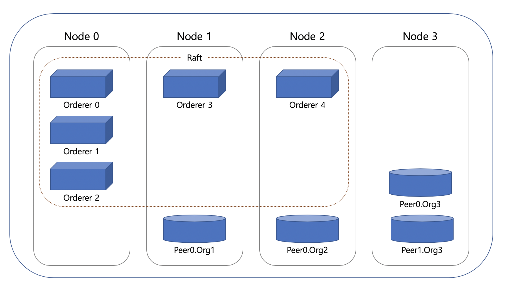

# Raft (멀티 노드)

## 구성 환경
- ### 오더러 타입: etcdraft
- ### 노드 구성

  - Node0: Orderer0, Orderer1, Orderer2
  - Node1: Orderer3, peer0.org1
  - Node2: Orderer4, peer0.org2
  - Node3: peer0.org3, peer1.org3
  
